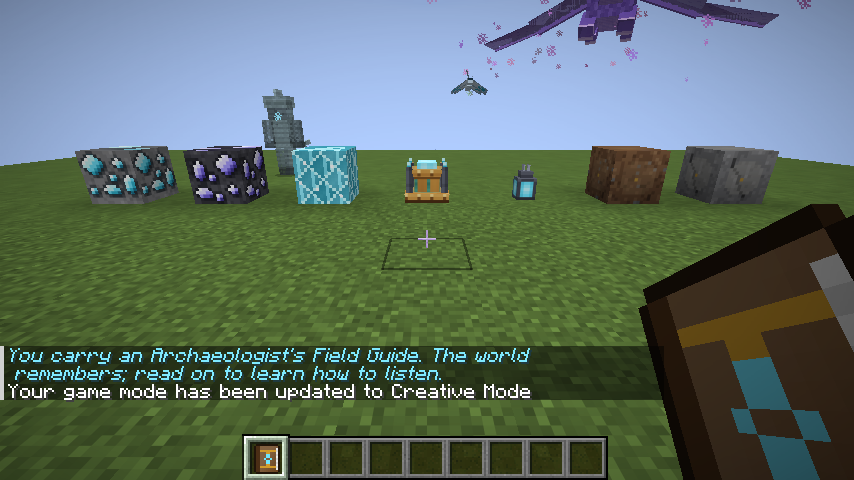
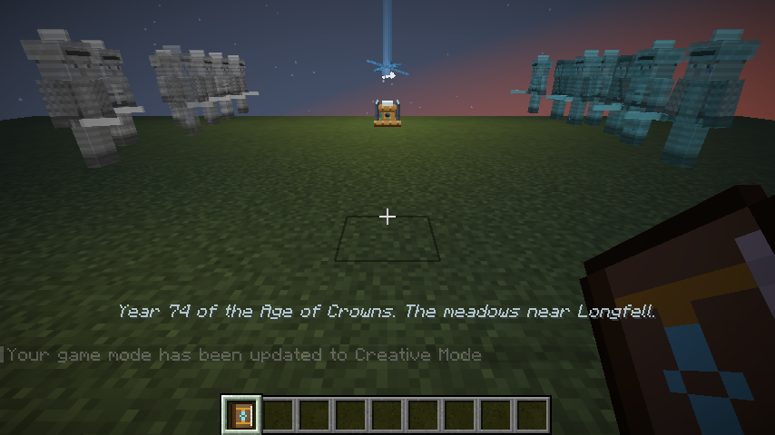
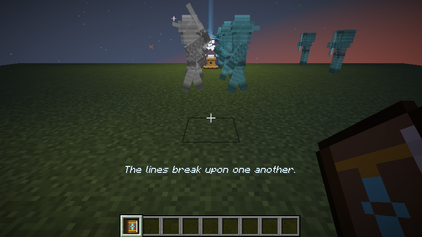
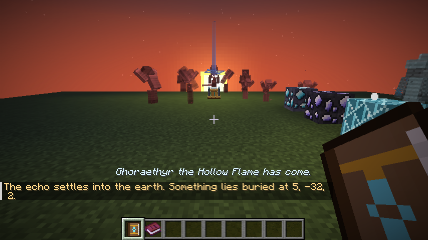

# Echoes of the Past

*A lore-archaeology mod for Minecraft Java Edition 26.3 (Fabric).*

The world remembers. Over centuries, the strongest moments of the past (battles, coronations, rituals, dragon
attacks) crystallize into **echo deposits** deep in the stone. Chisel one free, place it in an **Echo Projector**, and
a ghostly, holographic replay of that event plays out around you, exactly where it happened, hundreds or thousands
of years ago.

Every chunk of every world has its own history, generated deterministically from the world seed. The deeper an echo
forms, the older the memory it holds.







*Screenshots are captured automatically by the client game test in CI.*

## Gameplay

### 1. Find echoes
* **Echo Deposits** and **Deepslate Echo Deposits** generate underground in every Overworld biome. They glow
  faintly, shed motes of light and chime softly when you are near.
* Mining one with a pickaxe shatters the memory into **Echo Shards** (Fortune applies). Silk Touch takes the whole
  deposit.
* A **Resonance Compass** (compass + 4 echo shards) listens for the nearest deposit within 24 blocks and points to it.
* Feed **Echo Dust** to a wild **Memory Moth** and it will attune to you and fly to the nearest deposit, circling it.

### 2. Extract them intact
Hold right-click on a deposit with an **Archaeologist's Chisel** (iron + copper + stick) to work it free. After a few
seconds of careful tapping you get an **Echo Block**: an item that remembers *where* it formed, *how deep* it was,
and *what* it witnessed. Its tooltip names the event.

| Depth | Era | Years ago |
|---|---|---|
| y ≥ 48 | The Age of Hearths | 150 – 400 |
| 16 – 47 | The Age of Crowns | 400 – 900 |
| −16 – 15 | The Age of Iron and Ash | 900 – 1,600 |
| −48 – −17 | The Age of Dragons | 1,600 – 3,000 |
| below −48 | The Elder Dawn | 3,000 – 6,000 |

### 3. Project the memory
Place an Echo Block in an **Echo Projector** (glass, echo shards, amethyst and copper). The projector spins up, a
column of light rises, and the event is replayed by translucent, glowing figures tinted in the colors of the
factions that fought, traded or prayed there:

* **Battle**: two armies exchange volleys, charge and clash; the defeated fall and fade.
* **Siege**: defenders line the walls while a ram is carried to the gate; the sally or the fall of the keep.
* **Dragon Attack**: villagers flee as a spectral dragon circles and breathes ghost-fire; archers make their stand.
* **Market Day**: caravans arrive, merchants haggle, a juggler draws a crowd.
* **Coronation**: lords kneel as a ruler walks the aisle to be crowned (or betrayed).
* **Ritual**: a circle of mages chants until a pillar of light answers.
* **Duel**: two champions bow, circle and fight inside a ring of onlookers.
* **Festival**: dancers circle a bonfire to a fiddler's tune.
* **Exodus**: a long column of refugees leaves home forever.
* **Cave-in**: miners work a rich vein until the tunnel comes down.

Each replay is narrated on screen with the event's title, its date and five lines of story. Settlement names are
consistent across neighbouring chunks, factions have names and heraldry, and heroes, villains and dragons have
names and epithets.

Everyone watching receives an **Echo Transcript**: a written book chronicling the event in full.

### 4. Dig up what was left behind
Replay an echo **in the chunk where it formed** and the memory settles into the earth: a **Disturbed Earth** or
**Disturbed Stone** block appears where relics of the event lie buried, at a depth matching its era. Brush it with a
vanilla brush to recover relics themed to the event:

* **Legionnaire's Blade**: a sturdy relic sword that can strike phased spirits.
* **Tarnished Crown**: a helmet; Lingerers will not raise a blade against anyone who wears a crown.
* **Heirloom Locket**: show it to a Lingerer and it finally rests (and leaves gifts).
* **Festival Charm**: a consumable good-luck charm (Regeneration, Luck and Speed).
* **Ancient Coins**, **Wyrmscales**, and period loot from battles, markets, rituals and mines.

A replay played far from home still teaches its story, but the transcript tells you where to take the echo to find its
relics.

### 5. Beware what follows the memory back
Violent memories are unstable. Near the end of a battle, siege, ritual or dragon attack the replay may warn that it is
**destabilizing**, and when it ends a rift can open:

* **Lingerers**, the ghosts of soldiers who never left the battlefield, step out of the echo. They periodically
  *phase* out of time, becoming immune to ordinary weapons and blinking toward their foe. They also haunt deep
  caves naturally, and fade away in daylight.
* A dragon-attack memory from the **Age of Dragons** or the **Elder Dawn** can let the **Echo Wyrm** itself tear free:
  a flying boss with a boss bar that circles its old hunting ground, dives at intruders, breathes spectral fire and
  calls its fallen soldiers to its side at half health.

Defeat the Wyrm for its **Wyrm Heart**, **Wyrmscales** and the music disc **"The Last Chronicler"**. Forge the
**Echoing Blade**, whose every blow is struck again a moment later by a ghostly afterimage, and a set of
**Wyrmscale armor**.

## Content overview

| Blocks | Items | Mobs |
|---|---|---|
| Echo Deposit, Deepslate Echo Deposit | Echo Shard, Echo Dust, Echo Block | Lingerer (hostile) |
| Echo Projector | Archaeologist's Chisel, Resonance Compass | Memory Moth (ambient, tameable guide) |
| Block of Echo Crystal, Echo Lantern | Legionnaire's Blade, Tarnished Crown, Heirloom Locket, Festival Charm, Ancient Coin | Echo Wyrm (boss) |
| Disturbed Earth, Disturbed Stone (brushable) | Wyrmscale, Wyrm Heart, Echoing Blade, Wyrmscale armor, Music Disc | Echoes (replay holograms, 10 roles) |

There are 13 advancements in their own tab, including **Keeper of Ages**: witness every kind of event the world
remembers.

### Commands
* `/echoes history`: lists the remembered history of the chunk you stand in, one event per era.
* `/echoes give <era>` (operators): conjures the echo of your chunk from the given era.
* `/echoes replay <pos> <era>` (operators): starts a replay in the projector at `pos`.

## Building

Requires Java 25.

```sh
./gradlew build            # compile and package build/libs/echoes-of-the-past-<version>.jar
./gradlew runGameTest      # server game tests (history, projector, replays, relics, mobs, data)
./gradlew runClient        # play in a development client
```

Install the jar in `.minecraft/mods` together with **Fabric Loader 0.19.5+** and **Fabric API** for Minecraft 26.3.

### Regenerating assets
All textures, sounds and data files are generated by the scripts in `tools/`:

```sh
pip install pillow numpy scipy soundfile
python3 tools/gen_textures.py   # pixel art for blocks, items, entities, GUI and the mod icon
python3 tools/gen_sounds.py     # synthesized sound effects and the music disc
python3 tools/gen_data.py       # models, blockstates, loot tables, recipes, tags, worldgen, advancements, lang
```

## How it works

* `history/`: a pure-Java, deterministic history generator. `HistoryGenerator` derives one event per era for any
  chunk from the world seed; `Chronicler` writes its title, narration and transcript; `NameGen` names the people,
  places, factions and dragons.
* `replay/`: `Choreographer` stages each kind of event as a timed script of actors, movements, poses, effects,
  sounds and narration beats.
* `projection/`: `ReplayDirector` performs a script in the world with synced hologram entities; `ReplayOutcome`
  hands out transcripts, buries relics, grants advancements and opens rifts.
* Rendering uses custom entity models (a humanoid with role props, a serpentine wyrm, a moth, and the projector's
  light-work) drawn translucent and full-bright with a flickering, faction-tinted hologram look.

## License

MIT
